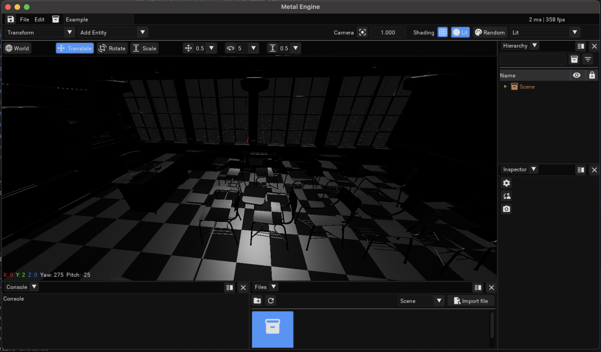

# Metal Engine
Metal Engine is a real time graphics engine written in C++ and backed by Vulkan

## Stack
- Serialization with Cereal (binary) 
- Assimp for scene parsing
- Rendering with Vulkan
- Windowing with GLFW
- UI with Dear ImGui